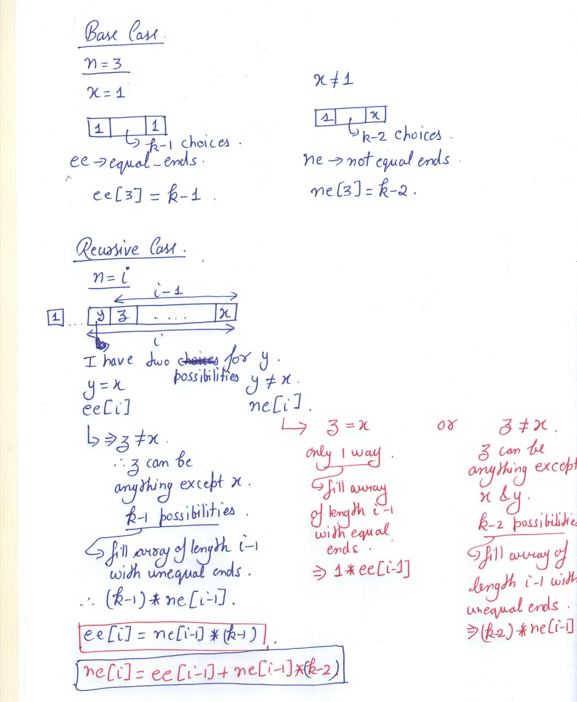

### [Construct the Array](https://www.hackerrank.com/challenges/construct-the-array/problem)

#### Solution C++

```cpp
#include<bits/stdc++.h>
#define mod % 1000000007
#define lli long long 
#define vli vector<lli>
using namespace std;

lli solve(int n, int k, int x)
{
	vli ee(n+1, 0);
	vli ne(n+1, 0);

	ee[3]=k-1;
	ne[3]=k-2;
	for(int i=4;i<=n;i++)
	{
		ee[i] = (ne[i-1]*(k-1)) mod;
		ne[i] = (ee[i-1] + (ne[i-1]*(k-2)) mod ) mod;
	}
	if(x == 1)
		return ee[n];
	else
		return ne[n];
}
int main()
{
	ios_base::sync_with_stdio(false);
	int n,k,x;
	cin>>n>>k>>x;
	cout<<solve(n,k,x);
}
```

#### Explanation

