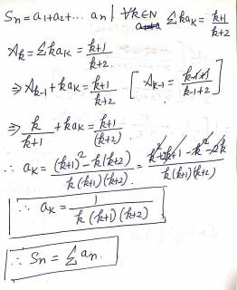
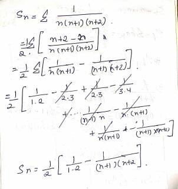

## [Problem](https://www.spoj.com/problems/TOHU/)

Find S<sub>n</sub> = a<sub>1</sub> + a<sub>2</sub> + ..... a<sub>n</sub>. Provided for all k 

A<sub>k</sub> = a<sub>1</sub> + 2\*a<sub>2</sub> + 3\*a<sub>3</sub> .... k\*a<sub>k</sub> = (k+1) / (k+2)

## Solution

1. Solving Recurrence: **A<sub>k</sub> = A<sub>k-1</sub> + k\*a<sub>k</sub>**
    - We'll get: **a<sub>k</sub> = \[ 1 / ( k \* (k+1) \* (k+2)) \]**  
    
    - Note: This is true only for k >= 2 
        + a<sub>1</sub> (as per above formula) = 1 / 6
        + a<sub>1_org</sub> (k+1 / k+2) = 2 / 3
        + We'll need to adjust this in final Summation.
            + Answer = (Σ a<sub>n</sub>) - a<sub>1</sub> + a<sub>1_org</sub>   

2. Solving Summation: S<sub>n</sub> = Σ a<sub>n</sub>  
    - We'll get: **S<sub>n</sub> = (1/2) \* \[ 1/2 - {1 / ((n+1)(n+2))} \]**  
    

## CPP code
```cpp
#include<bits/stdc++.h>
using namespace std;

int main()
{
    int t;
    double n;
    cin.sync_with_stdio(false);
    cin>>t;
    while(t--)
    {
        cin>>n;
        double ans = 0.5 * ( 0.5 - 1 / ( (n+1) * (n+2) ));
        ans = ans - (1/6.0) + (2.0/3.0);
        printf("%0.11lf\n", ans);
    }
}
```